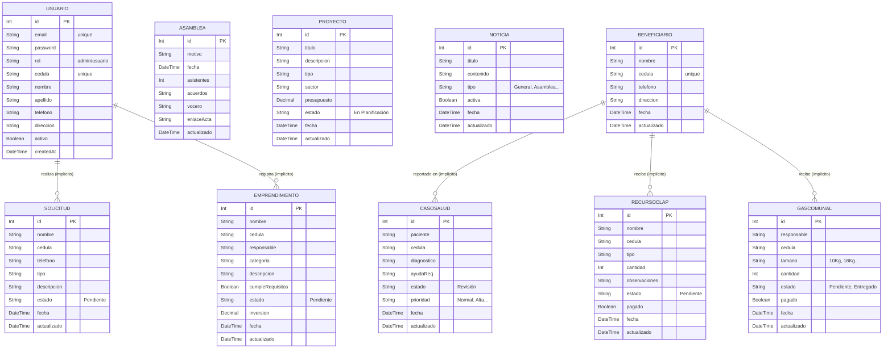

# Documentación Arquitectónica - Base de Datos (San Isidro Digital)

Este documento detalla la estructura y el modelo Entidad-Relación de la plataforma San Isidro Digital, manejada mediante Prisma ORM sobre una base de datos PostgreSQL.

## Enfoque Desacoplado

Las tablas y el sistema están diseñados de manera "Desacoplada" e independiente. Los módulos (Gas, Salud, Emprendimientos, etc.) operan insertando registros de forma auto-contenida con la cédula y otros datos personales.
Esto permite la adición directa de ciudadanos mediante números de cédula sin exigir que previamente hayan creado una cuenta en la aplicación oficial (Usuario), lo que facilita enormemente el empadronamiento de personas vulnerables y la gestión comunitaria rápida.

A continuación, el diagrama de Entidad-Relación generado con Mermaid:

### Notas sobre los Módulos
1. Módulo **CLAP:** Maneja cantidad, observaciones y estado del pago para facilitar el cobro y rastreo.
2. Módulo **Gas Comunal:** Adapta diferentes tamaños de cilindro (10Kg, 18Kg...) de manera fluida.
3. Módulo **Consultas (Beneficiario):** Guarda la directriz base del censo para verificar perfiles rápidamente.
